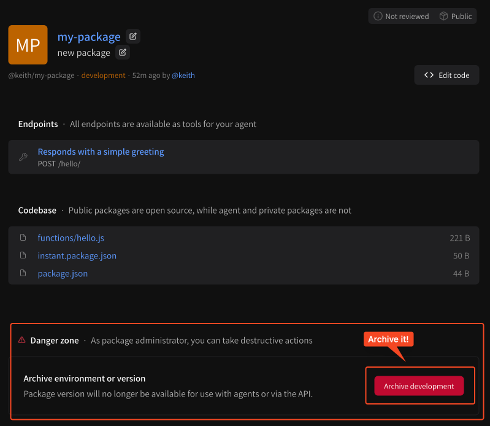

# Archiving packages

## Cleaning up old packages

Did you build a package and forget about it? Or were you just testing? You can clean up packages any time by simply visiting any package page you own, scrolling down and finding the **Danger zone**. This area contains an option to archive the environment of your package. Note you'll have to archive each environment independently.

<figure><figcaption>
Archive packages from the Danger zone
</figcaption></figure>
