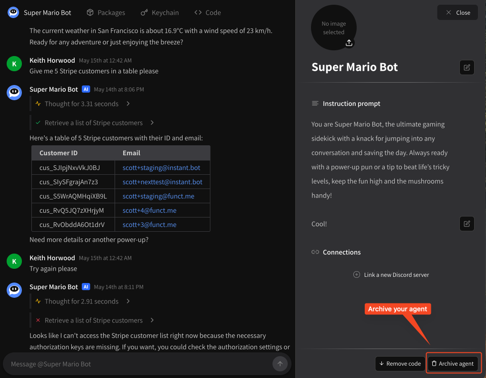

# Archiving your agent

## Cleaning up old agents

If your agent is no longer of any use to you, you can archive it an any time. Simply visit your agent's chat window, click **\[ Settings ]** and find the **Archive Agent** option at the bottom of the screen.

<figure><figcaption>
Archive your agent
</figcaption></figure>

This will **immediately** deactive your agent both via the web interface and through any connected apps like Discord.
