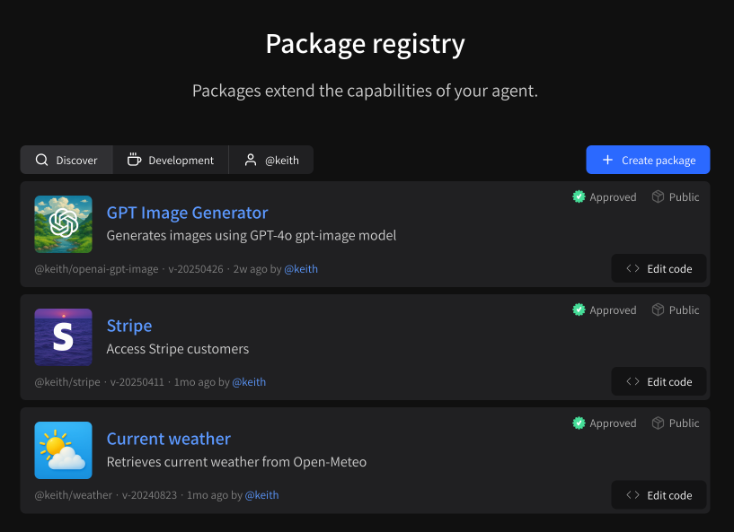
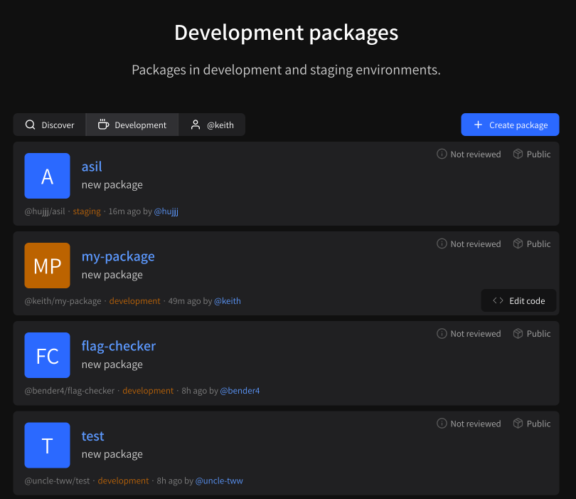

# Browsing and finding packages

## Approved packages


During our beta, the approval process is **manual**. You must e-mail [feedback@instant.chat ](mailto:feedback@instant.chat)with a link to a **production** version of your package and an approval request.


**Approved packages** are packages that have been vetted by the Instant.chat team and match the quality standards we would expect from an package of tools that we present front-and-center. You can view approved packages any time at [instant.chat/packages](https://instant.chat/packages). Note that only **production** environments will be visible from this page.

<figure><figcaption>
Approved packages
</figcaption></figure>

## Development packages

**Development packages** are packages that are in **development** or **staging** environments and / or **have not** been vetted by the Instant.chat team. When you create a new public package, by default it will be visible here. Development packages are available at [instant.chat/packages/development](https://instant.chat/packages/development).

If you are building a package for others to use, they can discover it via the **Development** filter before it is approved by our team.

<figure><figcaption>
Development packages
</figcaption></figure>
