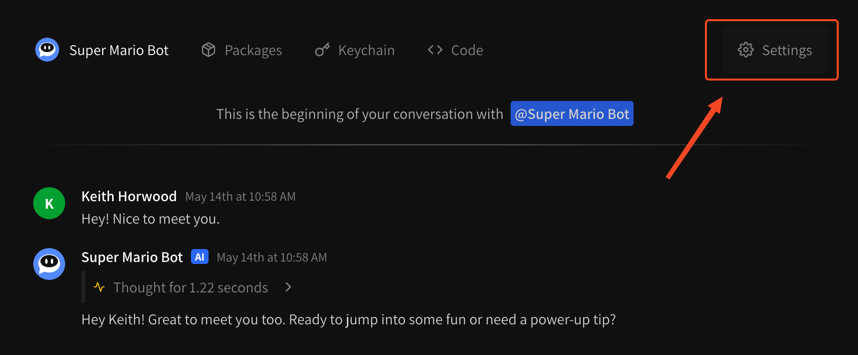

# Customizing your agent settings

## What settings can I change on my agent?

Currently, you can change the following settings on your agent:

* Display name
* Profile picture
* Instruction prompt
* Connections (link to Discord, etc.)

If you would like to customize a part of your agent you don't see here, please contact us at [feedback@instant.bot](mailto:feedback@instant.bot) ASAP.

## Changing your agent settings

All agent settings can be customized from the **Settings** tab in the top right of your agent's chat page.

<figure><figcaption>
Click here to customize agent settings
</figcaption></figure>

From here, we can configure the **display name**, **profile picture**, **instruction prompt**, and **connections**. More information about instructions prompts can be found here:


[modifying-instruction-prompt.md](modifying-instruction-prompt.md)


To modify the display name, profile picture, or connections simply click on the corresponding button. For display name, it's the edit button next to the name. For profile picture, it's the upload icon next to the profile picture itself, however clicking on the profile picture will also work. Finally, for changing third-party connections like Discord, just click the **\[ + Link a new Discord server ]** button and follow the instructions.

<figure><figcaption></figcaption></figure>

## Display name

The display name of your agent is what is visible to you and end users in any chat view — on the web, in Discord, in Slack, you name it. Modifying it is easy: click the edit button, change the name, and save it. Voila! Your agent has a new name.

## Profile picture


Note that in Discord **your profile picture will not change in the online list**, only in response messages. This is a limitation of the Discord app ecosystem.


Your agent's profile picture controls how it appears on the Instant.bot web interface or on third-party services like Discord and Slack. Just click on your profile picture and upload a new one to change it. We will automatically crop the image to centered square.

## Connections

Connections are how you deploy your agent to places where you work or you expect your users to interact with your agent. Currently we support;

* [On the web](using-your-agent/on-the-web.md) (default, via Instant.bot)
* [Discord](using-your-agent/discord.md)

We have the following connections planned;

* [Slack](using-your-agent/slack.md)
* [Website embed](using-your-agent/website-embed.md)
* [Developer API](using-your-agent/developer-api.md)

You can reach out to us at [feedback@instant.bot](mailto:feedback@instant.bot) if you'd like anything prioritized here!
