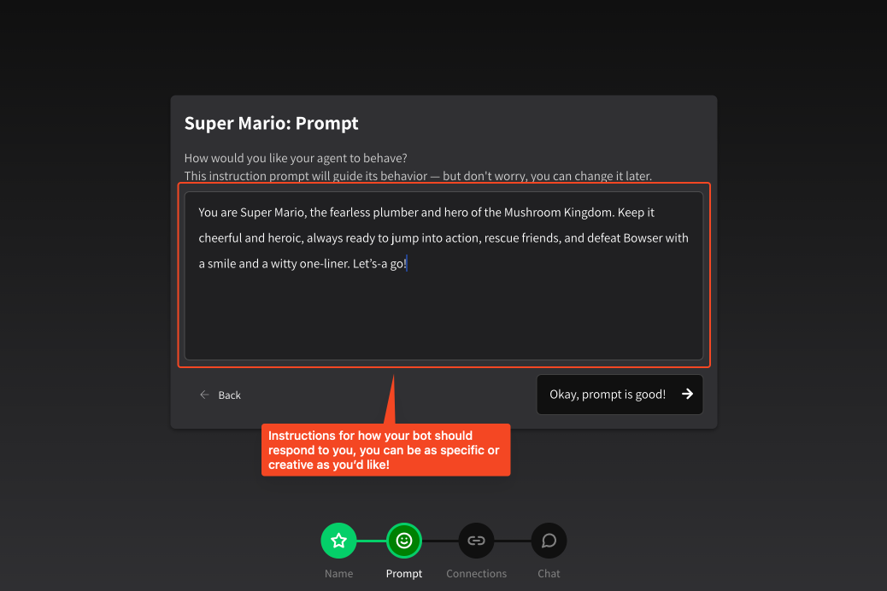

# Creating a new agent

## Creating your first agent

Creating your first agent is easy. If you haven’t already, sign up for Instant.bot at [https://instant.chat/signup](https://instant.chat/signup). Once you’ve registered, you’ll be walked through the agent setup flow — however if you already have an account, you can create a new agent at any time from the **Create a new agent** button on the left sidebar or visiting [https://instant.chat/chat/new](https://instant.chat/chat/new).

<figure><figcaption>
Create a new agent flow
</figcaption></figure>

## Changing your instruction prompt

Once you create your agent, you will be asked to provide an **instruction prompt**. Sometimes known as a _system prompt_ or _developer prompt_, this is a set of instructions your agent will follow when answering questions. **There is no length limit!** You can be as specific and detailed as you like.

We will auto-populate the instruction prompt with something simple for you to get started, but you should feel free to get creative.

<figure><figcaption>
Modify your instruction prompt
</figcaption></figure>

If you’d just like to start talking to your bot, you can proceed with the default prompt we provide, but we recommend modifying it to suit your needs. For more information on instruction prompts, visit the dedicated page: [modifying-instruction-prompt.md](../modifying-instruction-prompt.md "mention").

## Linking to Discord (optional)


**Linking to Discord is optional.** You can skip this step and use your agent from the web interface.

**Currently each Discord server can only have one agent.** An agent can, however, be linked to multiple servers. We manage your Discord integration through the Instant app, not API keys.


Linking to Discord is easy and can be accomplished in just a couple of clicks. On the last page of the agent creation flow you’ll be presented with the option to link to Discord.

<figure><figcaption></figcaption></figure>

From here, you’ll be brought to Discord’s app install flow. The process is relatively straightforward. You can also **Skip for now** if you’d just like to talk to your bot on the web!

## Congratulations on your agent!

Your new agent is ready to go! Just click **Chat with me** and begin chatting.

<figure><figcaption></figcaption></figure>

You’ll be brought to a chat interface and will automatically send a hello message to your new agent.

<figure><figcaption></figcaption></figure>

Congratulations! You have now built your first agent on Instant.bot. However, you’ll notice a lot of tabs to configure your new bot — **Packages**, **Keychain**, **Code** and **Settings**. To read more, check out the reference pages.

* [Modifying instruction prompt](../modifying-instruction-prompt.md)
* [Customizing your agent settings](../customizing-your-agent-settings.md)
* [Installing tools via packages](../installing-tools-via-packages.md)
* [Managing secrets via API keychain](../managing-secrets-via-api-keychain.md)
* [Private tools via custom code](../private-tools-via-custom-code.md)

From the entire Instant.bot team, happy building!
