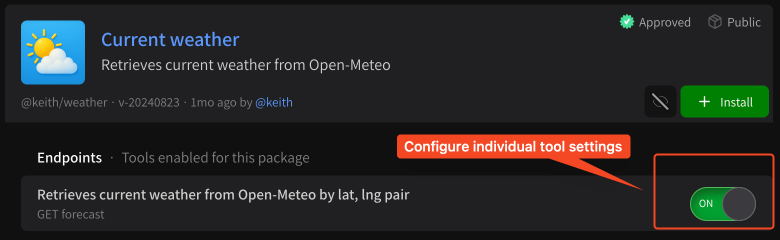

# Installing tools via packages

## What are packages?

Packages are collections of tools that you can use to extend your agent like [generating images via OpenAI](https://instant.bot/packages/@keith/openai-gpt-image), [retrieving Stripe customers](https://instant.bot/packages/@keith/stripe) or [getting the current weather](https://instant.bot/packages/@keith/weather).

### Technical details

Each tool is a **function** that takes **arguments** a.k.a. request parameters and returns a **response**. You can read more about packages on [Package overview](specifications/package-specification.md), but in the most basic sense packages are a group of related functions will take some input and return an output.

```
fn(input) = output
tool(argA, argB, argC) = response

e.g.
get_weather(lat, lng) = { temperature, wind_speed }
get_customers(count) = [ { name, age, payment_method }, ... ]
```

Packages are standalone REST HTTP API servers. They run on auto-scaling serverless architecture via AWS Lambda behind an [Instant API](https://github.com/instant-dev/api) gateway that performs type-validation and coercion automatically.

## How do I install packages?

You can manage your agent's installed packages via the **Packages** tab in the top toolbar on your agent's chat page. When you click this tab you'll be able to see your installed packages.

<figure><figcaption><p>View your installed packages.</p></figcaption></figure>

By default your agent won't have any packages installed. In this case you can select the **Discover** sub-tab to find suitable packages.

<figure><figcaption><p>See packages approved by the team</p></figcaption></figure>

The **Discover** tab will **only show approved packages**, that is, packages that have been vetted by the Instant.bot team for security and authenticity purposes. Before we install a package, we can check the package details by **clicking on the name** or by **clicking the eye button** to view individual endpoint settings.

<figure><figcaption><p>Click the eye button to view tools and settings for the package</p></figcaption></figure>

For the **current weather** package, we can click the eye button to see which endpoints it has before installing. From here we can toggle individual tools on or off.

<figure><figcaption><p>Turn individual tools on our off</p></figcaption></figure>

For this package, there is only one tool. We want it enabled! So let's go ahead and click **\[ + Install ]**. You should see a popup like below:

<figure><figcaption><p>Package installed successfully</p></figcaption></figure>

That's it! You should now be able to use the current weather package.

## Using installed packages

Once a package is installed, your agent will **automatically detect when to use it** based on your requests. For example, for the weather package above, we can ask the agent something like:

```
What's the current weather in San Francisco?
```

And your agent should go through two steps:

1. **Planning:** your agent determines what tools it has available and if it should use any to answer your query.
2. **Execution:** your agent calls any and all functions necessary to complete your request.

The result should look something like this:

<figure><figcaption><p>It got the weather for me!</p></figcaption></figure>

You can click on either the **Thought \[...]** button (in this case, _Thought for 2.35 seconds_) or the **Function \[...]** button (_Retrieves current weather..._) to expand details and see how your agent thought about this task and executed on it:

<figure><figcaption><p>Planning details</p></figcaption></figure>

<figure><figcaption><p>Tool call details</p></figcaption></figure>

You can use these buttons to debug your agent and figure out which packages and tools work best.
