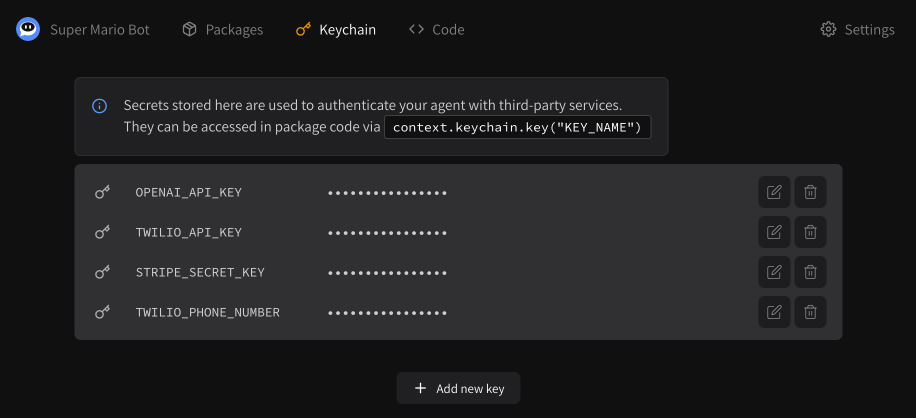
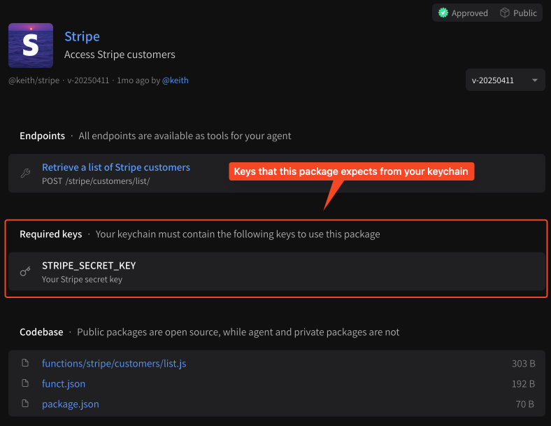
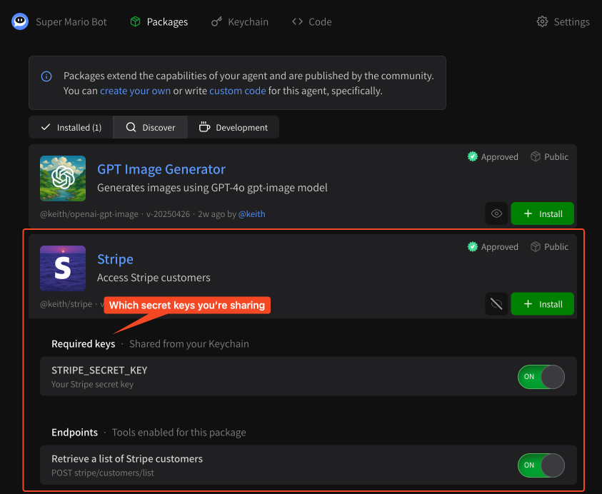
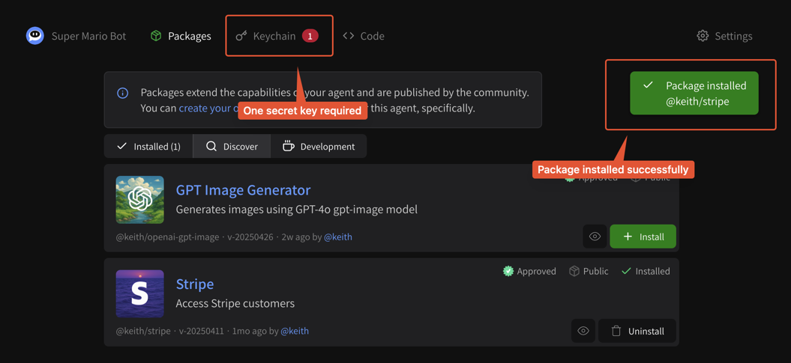
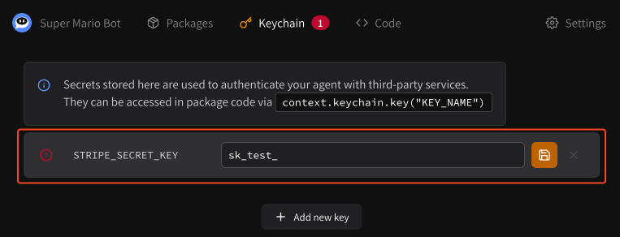
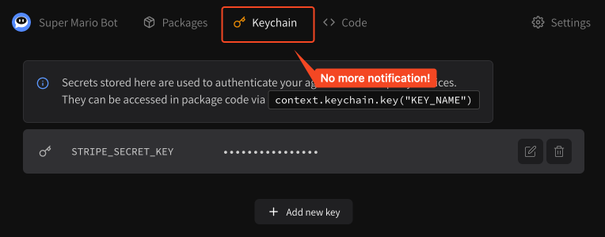
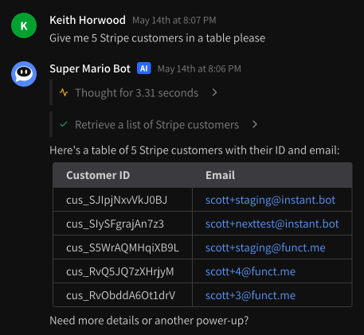
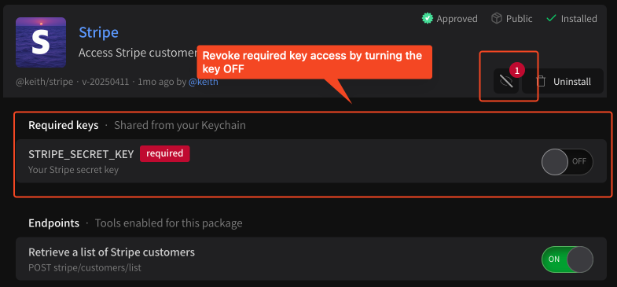
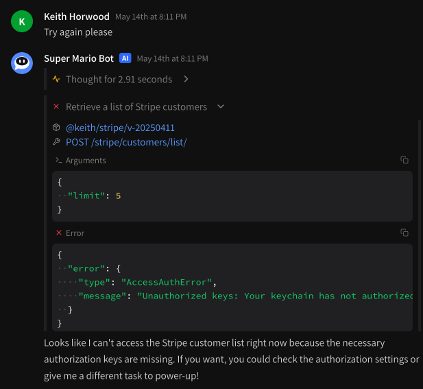

# Managing secrets via API keychain

## What is an API keychain?

API keychains are an auth primitive we have introduced for building and using hosted tools. They store multiple **secret keys** that authenticate you into third party services like Stripe, OpenAI and more. In order to use packages that require third-party authentication, you must add the appropriate key to your keychain and choose to share it with each package that requests it. We manage this through the Instant.bot user interface automatically.

<figure><figcaption><p>Manage multiple API secrets from your API keychain</p></figcaption></figure>

### Technical details

You can read more about API keychains on [API keychain overview](specifications/api-keychain-specification.md). A quick summary of how they work;

* Each API keychain stores multiple secrets
* Each API keychain has a JSON config attached corresponding to a service, that looks like `{"@user/package": { version: "v-20250101", keys: ["STRIPE_SECRET_KEY"] }`, where the `"keys"` field indicates which keys it can share with that service.
  * **We automatically create this configuration from the Web UI**
* Each API keychain itself has a **secret key** which can be used as a `Bearer` token
* When you make a request to a package at `{package}.instant.host` you provide `Authorization: Bearer {API_KEYCHAIN_SECRET_KEY}`
* If the API keychain has the package configured, it will make the keys in its `key` field available
  * **But only if the package requests the key from its `instant.package.json` config!**
  * e.g. if they key hasn't been specifically requested by the package, it will **not** be shared
  * this double opt-in strategy prevents (1) over-provisioning of keys per-package and (2) leakage of secrets
* The package requesting the secret key then uses the key in code using `context.keychain.key("KEY_NAME")`
* You can **only share secret keys with open source packages**, all code can be manually verified
* You can read more about the context object in [Package overview](specifications/package-specification.md)

## Security measures

For a complete breakdown of API keychain security, please read the [API keychain overview](specifications/api-keychain-specification.md).

* API keychains provision your agent's access to packages and control which secrets are shared
* Secrets are **encrypted at rest**, they are only exposed at runtime
* Secrets are shared in a **double opt-in** fashion: the package transparently requests which keys it requires, and keychains (or the end-user) manually approve each secret
  * In theory this can be done at runtime, but in practice it is configured ahead of time at package installation
* API keychains **automatically revoke** secrets access by a package if the SHA256 checksum of the package changes; preventing MITM attacks where e.g. a bad actor takes control of a package and overwrites running code
  * We can do this because we host the code for the packages

## Using your agent's API keychain

### 1. Install a package that requires a secret key

To use your agent's API keychain you need to use a package that requires an API key. For the purposes of this getting started guide we'll use the [Stripe customers package](https://instant.bot/packages/@keith/stripe) which requires a `STRIPE_SECRET_KEY`. You can verify this on the package page.

<figure><figcaption><p>Packages will display which keys they require</p></figcaption></figure>

You can also see this directly from the package discovery page, where if you click the eye icon, you can configure which tools and secrets you actually want to share with the package.

<figure><figcaption><p>Configure which secrets you share from the eye button</p></figcaption></figure>

If we go ahead and hit **\[ + Install ]**, the package will install and a red **(1)** will appear next to your **Keychain** tab in the toolbar:

<figure><figcaption><p><strong>STRIPE_SECRET_KEY</strong> is now required</p></figcaption></figure>

### 2. Set your secret key on your API keychain

If you click on the **Keychain** tab you can now insert your secret key.

<figure><figcaption><p>Add your secret key</p></figcaption></figure>

For Stripe, the secret key is usually available at [https://dashboard.stripe.com/test/apikeys](https://dashboard.stripe.com/test/apikeys) for test keys or [https://dashboard.stripe.com/apikeys](https://dashboard.stripe.com/apikeys) for production keys. Copy and paste your key and hit the orange save button. The notification for required keys should disappear.

<figure><figcaption><p>No more notification for your keychain</p></figcaption></figure>

### 3. Use your package with your agent

You should now be able to use this package with your agent! Try something like;

```
Give me 5 Stripe customers in a table please
```

<figure><figcaption><p>Easy-peasy! 5 Stripe customers here we come.</p></figcaption></figure>

It's that easy!

## Revoking secret key access

There are two ways to revoke secret access.

* Uninstalling the package
* Manually removing secret access from the package settings
  * Click the eyeball to view package settings, then manually turn the secret key you wish to revoke to OFF

<figure><figcaption><p>Revoke key access</p></figcaption></figure>

Note that revoking key access will make the package effectively defunct. Your agent will still try to call it if requested, but it will always return an error.

<figure><figcaption><p>Your key has been revoked, AccessAuthError</p></figcaption></figure>

## That's it!

We hope you enjoy secrets management with Instant.bot! We're always open to new ideas and ways of authenticating with third-party services, feel free to drop us a line with suggestions to [feedback@instant.bot](mailto:feedback@instant.bot).
