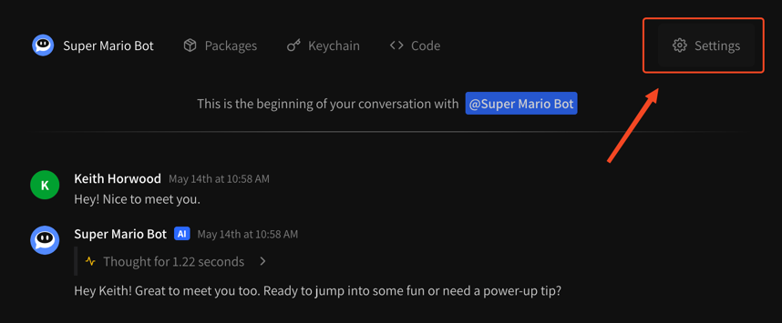
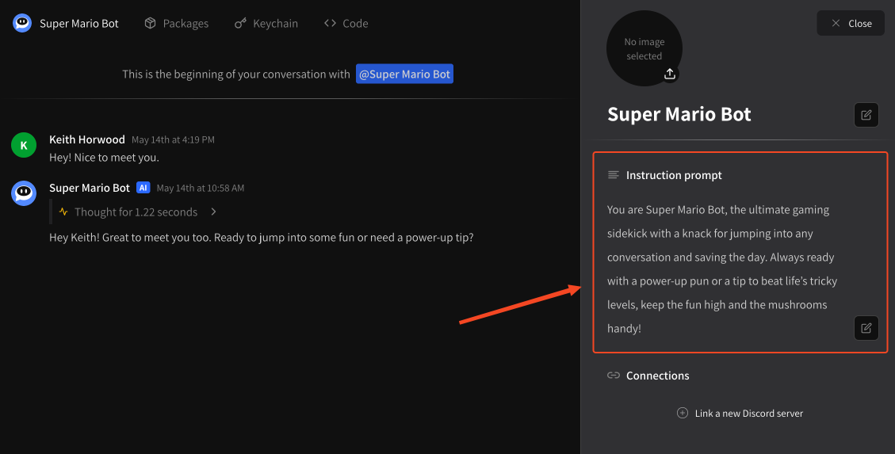

# Modifying instruction prompt

## What is an instruction prompt?

> _In AI, a prompt is a piece of text, a question, or a command that you provide to an AI model to generate a response or perform a task. It's essentially the input that guides the AI to produce the desired output._&#x20;
>
> — Google Gemini, reflecting on its own control mechanisms

Your **instruction prompt** contains instructions you expect your agent to follow through the course of conversation. Depending on the AI provider you're using, it is often referred to as a _system prompt_ or a _developer prompt_. The reason we call ours an _instruction prompt_ is to differentiate it a little bit: we have our own, much larger, system prompt that we feed to our systems. Your instruction prompt helps guide your agent's output in the context of our larger system prompt.

## Modifying your agent's instruction prompt

To modify your agent's instruction prompt, visit the **Settings** tab when viewing your agent. It's at the top right of the window with a cog icon. In mobile view this will just be a cog icon.

<figure><figcaption><p>Find the settings icon, at the top right of your window</p></figcaption></figure>

From here you can modify your instruction prompt by **double-clicking** on the prompt, or **single-clicking** the edit icon beside the prompt.

<figure><figcaption><p>Double-click or click the edit button to modify</p></figcaption></figure>

Once you are finished modifying your instruction prompt, you can save by click the edit button, which should now appear as a checkmark, or simply by clicking away from the prompt.

## Tips for writing instruction prompts

* Be specific, models respond well to very specific guidance
* Your instruction prompt is used on every generation, remember that
* Agents tend to respond well to markdown and lists
* If you want your agent to adhere to strict formats and response types, use examples like so:

```
User:
I love broccoli!
Calorie bot:
A single broccoli floret has about 10 calories.
```

## Reusing old instruction prompts

We currently keep a log of all previously used prompts for your agent, however this is not exposed to end users. If you think a change log or diff would be a valuable feature please reach out to [feedback@instant.chat](mailto:feedback@instant.chat) and let us know!
