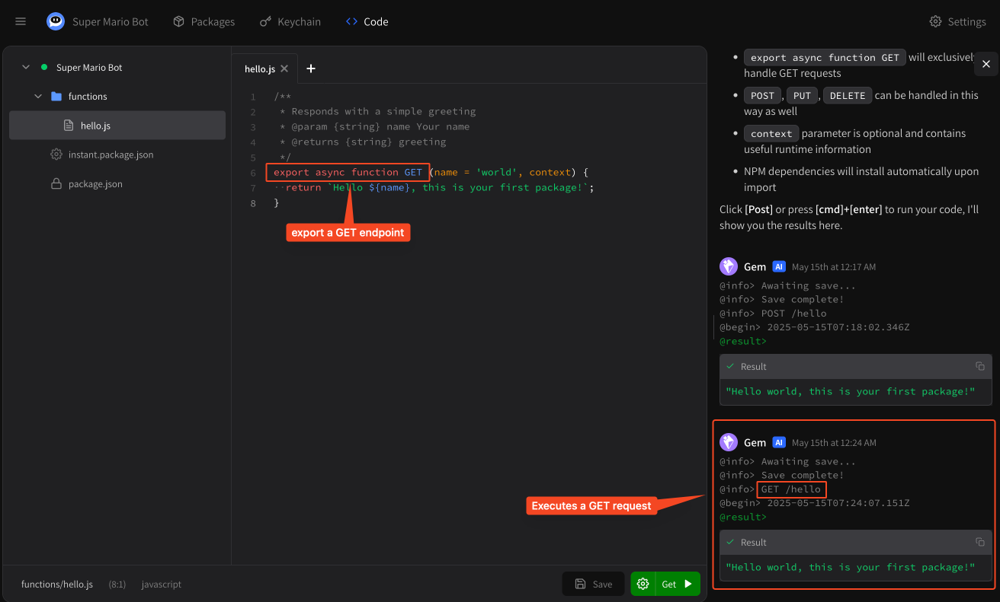
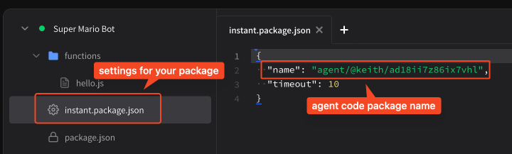

# Private tools via custom code

## What is a custom code package?

Every agent has its own **custom code package** that can be used to execute custom tools that aren't available via the public registry. You should build these tools when you want to host **proprietary tools** that connect to custom data sources you don't want exposed to the Instant.bot community.

Custom code packages **are not open source**. They are not published to our registry and users can not see the code that executes when they are called, though they can still see requests (arguments) and responses. You can build custom code packages from the **Code** tab in your agent's toolbar.

## In-depth code overview

This page serves as an introduction to writing custom code inside of our online IDE. For the most comprehensive, in-depth guide to packages please visit:


[package-specification.md](specifications/package-specification.md)


## Writing custom code

Click on the **Code** tab for your agent to create your own custom code package. A **light grey dot** indicates that your custom code package has not yet been deployed: it is not live.

<figure><figcaption><p>Grey indicates "not live"</p></figcaption></figure>

Your custom code package, by default, is a simple "hello world" function. You can deploy your code and make it live by hitting the **\[Post >]** button, which will deploy your code and test the endpoint you're looking at with an HTTP POST request. Click the **\[Post >]** button to deploy and test.

<figure><figcaption><p>Once you click <strong>Post</strong>, the function / tool is executed</p></figcaption></figure>

You can see the results of the tool request right in the online IDE. You can make as many changes as you want, every time you **Save** (press the button or type command + S) your new code package will be deployed. Running your package by pressing **\[Post >]** will automatically deploy and run your code package.

## Modifying your custom code

Custom code package functionality is dictated by the [Instant API framework](https://github.com/instant-dev/api). You can export up to four HTTP methods per file, corresponding to **POST**, **PUT**, **GET** and **DELETE**. If you export only a single default function, it will be accessible via **POST**.

You can change the HTTP method by changing the name of the function, for example a **GET request** would look like:

<figure><figcaption><p>Execute an HTTP GET request</p></figcaption></figure>

You'll notice the online IDE automatically changes the **\[Post >]** button to **\[Get >]** — it will by default find the first exported function and default to that.

To change which HTTP method you want to use, click the **cog** icon next to the HTTP method:

<figure><figcaption><p>Set custom payloads</p></figcaption></figure>

You can change sample payloads for each endpoint / tool using this window. When you hit the run button (or type command + enter) you'll execute the currently selected method with the currently set payload for that method.

## Installing NPM packages

We support most NPM packages on Instant.bot. You can import NPM packages by using the appropriate `import x from 'package'` syntax. For example, the Stripe package, `import Stripe from 'stripe'` should give the following result:

<figure><figcaption><p>Install the Stripe package</p></figcaption></figure>

NPM packages will be installed automatically. We support any NPM package without custom binaries and a number of them with. Currently **puppeteer** is unsupported, but if you have a strong use case please drop us feedback at [feedback@instant.bot](mailto:feedback@instant.bot).

## Writing complex functionality

If you're not happy with our online IDE, you can eject at any time to our [command line tools — ibot](https://github.com/instantbots/ibot). You just need to make sure you have the correct **name** set in `instant.package.json`.

<figure><figcaption><p>Set the package name properly</p></figcaption></figure>

The `ibot` command line utilities allow you to check your work into git, write tests and more. Please [check out our CLI on Github](https://github.com/instantbots/ibot).

## Changing timeout

By default, your tools in your custom code package will have a timeout of 10 seconds. Execution will automatically be interrupted. To change this, modify the `timeout` in `instant.package.json`. Timeouts up to `300` seconds (5 minutes) are supported.

## Setting app secrets and environment variables

There are two ways to set app secrets in custom code packages:

### 1. Via your API keychain

Your custom code package has access to all keys stored in your API keychain. To use them, make sure your endpoint has the magic `context` object as its last parameter:

```javascript
/**
 * Some tool
 * @param {number} amount
 */
export async function GET (amount, context) {
  // context is a magic argument that gets automatically populated
  // with runtime information if it is included as the last argument
  const key = context.keychain.key('MY_SECRET_KEY');
  // Now you can use your keychain key in code
  return `The key is ${key}`;
}
```

### 2. Via environment variables

You can also set environment variables using a `.env.development` file. Note that if you create a `.env` file it will automatically be converted to `.env.{environment}`, where `{environment}` is one of `development`, `staging`, `production`.

These environment variables are encrypted at rest and only decrypted at runtime, similar to your keychain keys, but are package-specific.

```sh
MY_SECRET_KEY=hello_world
```

```javascript
// Can access anywhere
const MY_SECRET_KEY = process.env.MY_SECRET_KEY;

/**
 * Some tool
 * @param {number} amount
 */
export async function GET (amount) {
  // we do not need a context object to access env vars this way
  return `The key is ${MY_SECRET_KEY}`;
}
```

## Testing your tools with your agent

To test your tools with your agent, simply ask your agent to execute them! Private tools are live immediately upon saving — no additional setup required.
