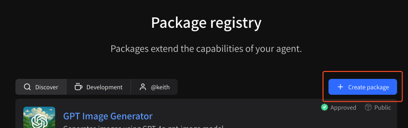
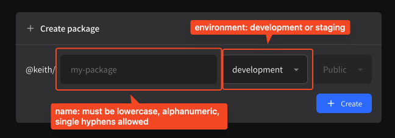
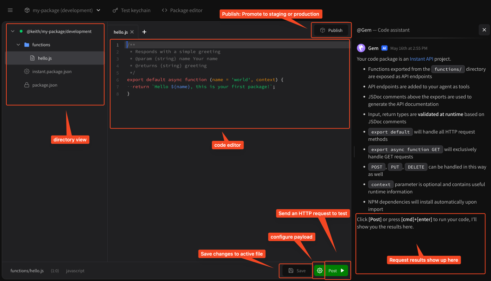
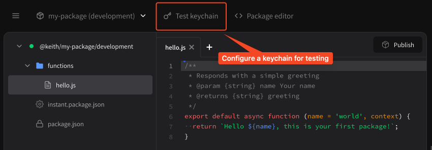
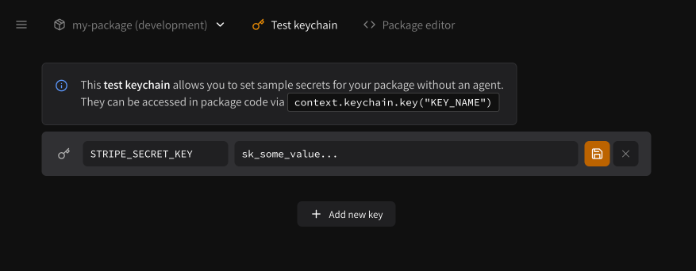
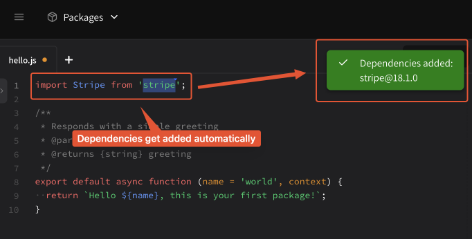

# Publishing via online IDE

## Introduction to the online IDE

Our online IDE provides a frictionless way to extend your agents with custom tools without leaving your web browser. It is ideal for lone developers prototyping simple tools and testing new flows. If you are building something comprehensive, we recommend using our command line tools: [publishing-via-command-line.md](publishing-via-command-line.md "mention").

## Features

Our online IDE comes with a bunch of features that make iterating on new tools a breeze;

* Automatically install NPM packages
* Use it like Postman: Configure REST payloads right from the IDE
* Run endpoints directly from the browser
* See streaming log results, errors and more

## Creating a new package

To create a new package using our online IDE find the **Create package** button on [instant.bot/packages](https://instant.bot/packages), or simply visit [instant.bot/packages/new](https://instant.bot/packages/new).

<figure><figcaption><p>Find the <strong>Create package</strong> button</p></figcaption></figure>

Once you're on the new package page, you'll see a prompt:

<figure><figcaption><p>Enter your package name and environment</p></figcaption></figure>

You can choose your **package name** and **environment**.

* **Package name:** must be alphanumeric, lowercase, single hyphens allowed
* **Environment:** development or staging, we recommend development to start

After you choose these, just hit **Create** to create your package!

## Online IDE basics

The online IDE has a few basic components:

<figure><figcaption><p>Main components of the online IDE</p></figcaption></figure>

* **Directory view:** Manage all of your files in your package, just like a traditional IDE.
  * Making changes to the directory structure (adding files, etc.) will automatically deploy your package to keep the live version in sync with the editor.
* **Code editor:** Make changes to your code. Complete with multi-cursor select (cmd+d) and find and replace.
* **Publish:** Once your package is ready, promote it to a `staging` or `production` environment
* **Save:** Save any changes to the currently active file.
  * This will automatically deploy your package to keep the live version in sync with the editor.
* **Configure payload:** Change the `GET`, `POST`, `PUT`, or `DELETE` parameters you test with for this file when you send an HTTP request. You can also choose which method you would like to send.
* **Send HTTP request:** Used for testing. You can configure which HTTP method you're using from the **Configure payload** button.
* **Request results / assistant:** See the results of running and testing your endpoint here.

## Deploying packages via the Online IDE


Our online IDE is **always synced** with package deployments.


Any changes you make in the online IDE are **instantly** deployed to our package registry. Including errors! We recommend building packages in a **development** environment first, and then once stable, promoting to a **staging** or **production** environment.

## Testing API keychains and secret sharing

In the toolbar for our online IDE you'll notice a **Test keychain** tab:

<figure><figcaption><p>Test keychain tab</p></figcaption></figure>

Clicking on this tab brings you to your **Test keychain** for this project. This keychain can **only ever be used** with this package to test it. You can use it to set your own keychain secrets that you may want end users to configure.

<figure><figcaption><p>Add test keys</p></figcaption></figure>

Once you've added keys here, you'll need to update `instant.package.json` like so (make sure to keep your package name the same).

```json
{
  "name": "@keith/my-package",
  "keychain": {
    "required": [
      {
        "name": "STRIPE_SECRET_KEY",
        "description": "Your Stripe secret key"
      }
    ]
  }
}
```

You can then access the `STRIPE_SECRET_KEY` (or whatever parameter you've added) via the [#the-context-argument](specifications/package-specification.md#the-context-argument "mention"), like so:

```javascript
export default async function (context) {
  const apiKey = context.keychain.key('STRIPE_SECRET_KEY');
  const stripe = new Stripe(apiKey);
  // go nuts!
}
```

## Installing NPM packages


NPM package install automatically when you write your import lines.


NPM package installation happens **automatically** as part of the deployment process. When you add in new `import` lines, like `import Stripe from 'stripe'`, our IDE will automatically install the packages for you.

<figure><figcaption><p>Type an import, install a package automatically</p></figcaption></figure>

## More features

Our IDE has more quality-of-life features baked in:

* Find and replace
* Multi-cursor select
  * cmd+d to highlight next matching word
  * cmd+click to add a cursor
  * esc to cancel multi-cursor select
* Uploading files
* Auto-indenting on paste
  * Intelligently matches copied code to IDE settings

We hope you enjoy! Please send any feedback on the IDE to [feedback@instant.bot](mailto:feedback@instant.bot).

