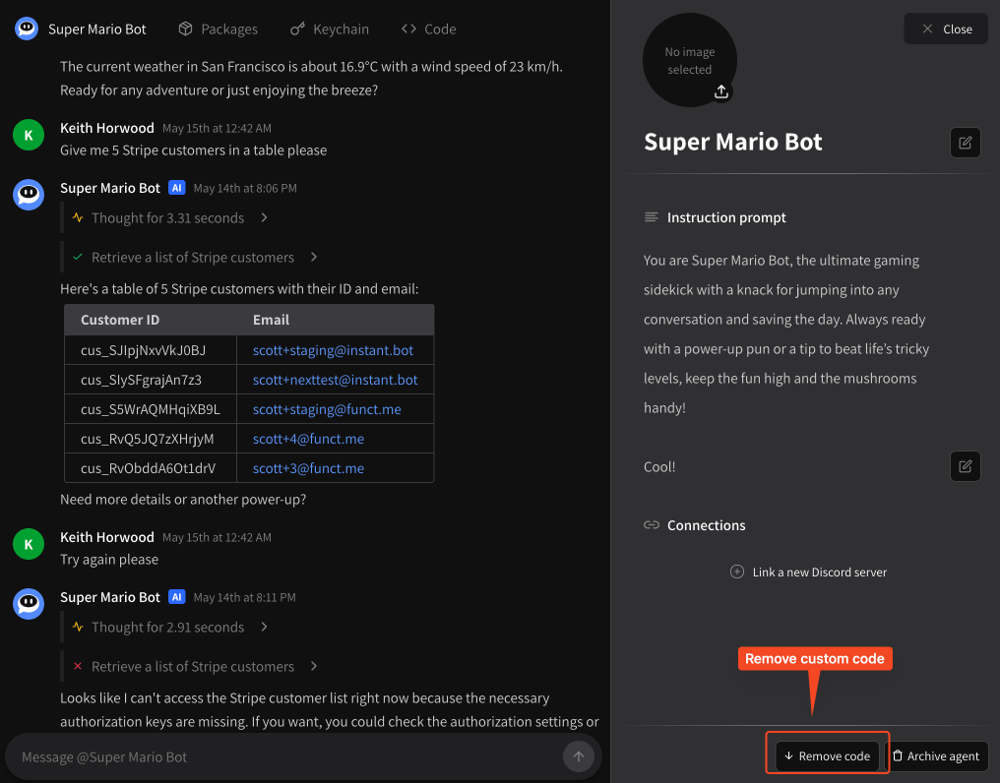

# Removing your custom code

## Removing custom code

If you want your agent to keep running, but no longer have a use for its custom code package, you can remove the custom code package at any time via the agent's **\[Settings]**.

<figure><figcaption>
Remove code
</figcaption></figure>

Clicking this button will immediately clear all custom code for the agent. To restore functionality, you'll need to go to the **\[Code]** tab and write the new functionality yourself.
