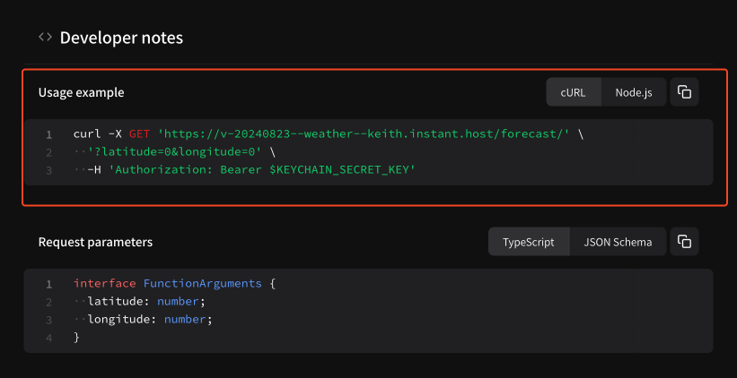

# API keychain specification

## Overview

API keychains are how authentication is managed for Instant.bot packages. They have three primary responsibilities.

1. Authenticate you via our gateway so you can use Instant.bot packages
2. Securely store third-party secrets and share them with packages
3. Delegate access to specific packages

## Security considerations

API keychains have the ability to **store and share** third-party secrets with packages. Packages can contain code written by you or third-party developers. This comes with security concerns; notably, how do I prevent unauthorized use of my keys?

At Instant.bot we take your security seriously and have a three-pillared approach.

1. API keychains can only share secrets with public packages
2. API keychains provision secret access on double opt-in, per package basis
3. Checksum validation: API keychains will automatically expire if the package SHA256 changes

#### 1. API keychains can only share secrets with public packages

Public packages are **open source**, which means you have the ability to manually inspect and verify all code that may have access to your secrets. For example, this [Stripe customers](https://instant.bot/packages/@keith/stripe) uses a `STRIPE_SECRET_KEY`. You can manually inspect the code to verify this is only used in the context of instantiating the Stripe package.

#### 2. API keychains provision secret access on double opt-in, per-package basis

You must manually add (a.k.a. install) each package to an API keychain. Every package has its own `instant.package.json` with a section that looks like this:

```json
// instant.package.json
{
  "name": "@user/package",
  "keychain": {
    "required": [
      {
        "name": "STRIPE_SECRET_KEY",
        "description": "Your Stripe secret key"
      }
    ]
  }
}
```

The `keychain.required` array tells us which keys this package wants permission to access. **Keys that are not manually requested in this way can never be shared with packages**. Then, in your keychain, you must manually specify which keys you want to share with the package as well. This is usually done via our Web UI, but the configuration looks like this.

```json
// keychain configuration
{
  "@user/package": {
    "version": "v-20250101",
    "sha256": "SOME-SHA256-HASH-...",
    "keys": ["STRIPE_SECRET_KEY"]
  }
}
```

So in order to share `STRIPE_SECRET_KEY` with `@user/package`, there's a double opt-in mechanism that prevents over-provisioning access:

* The package must explicitly request `STRIPE_SECRET_KEY` in `instant.package.json`
* Your API keychain must explicitly set `"STRIPE_SECRET_KEY"` in its configuration for this package as a key it is willing to share
* **Both of these must be present for a key to be shared**

#### 3. Checksum validation: API keychains will automatically expire if the package SHA256 changes

I am feeling confident — I have (1) verified the code publicly and (2) opted-in to sharing secrets. But what if a malicious package owner or hijacker overwrites a published package unbeknownst to me?

**Every package that gets published to Instant.bot gets automatically assigned a SHA256 hash based on its contents.** Two packages with identical structure and code will have identical SHA256 hashes.

When you provision package access, you **also** provision a specific SHA256 hash:

```json
// keychain configuration
{
  "@user/package": {
    "version": "v-20250101",
    "sha256": "SOME-SHA256-HASH-...",
    "keys": ["STRIPE_SECRET_KEY"]
  }
}
```

If for any reason the package hash changes from your installation or configuration time, **your keychain will stop working with this package**, preventing unauthorized use or access to your secret keys.

## Accessing API keychain secrets in package code

Once a package has added the necessary `keychain.required` settings in `instant.package.json`:

```json
{
  "name": "@user/package",
  "keychain": {
    "required": [
      {
        "name": "STRIPE_SECRET_KEY",
        "description": "Your Stripe secret key"
      }
    ]
  }
}
```

You can access the `STRIPE_SECRET_KEY` (or whatever parameter you've added) via the [#the-context-argument](package-specification.md#the-context-argument "mention"), like so:

```javascript
export default async function (context) {
  const apiKey = context.keychain.key('STRIPE_SECRET_KEY');
  const stripe = new Stripe(apiKey);
  // go nuts!
}
```

## Using your agent's API keychain

Your agent automatically has an API keychain assigned to it when it is created. It uses this API keychain to manage package access and share secrets with packages. All of this is handled directly via Instant.bot, and you can read more at [managing-secrets-via-api-keychain.md](../managing-secrets-via-api-keychain.md "mention").

## Using API keychains for authentication

You can create your own API keychains to use with packages at [instant.bot/dashboard/api-keychains](https://instant.bot/dashboard/api-keychains). If you do not yet have a keychain, you can create one at [instant.bot/dashboard/api-keychains/new](https://instant.bot/dashboard/api-keychains/new) or by clicking **+ Create API keychain** on the keychains page.

<figure><figcaption><p>Create an API keychain</p></figcaption></figure>

Each API keychain created here will have its own **secret key**.

<figure><figcaption></figcaption></figure>

You can use this secret as a `Bearer` token to access any public package available at [instant.bot/packages](https://instant.bot/packages).

```sh
curl https://{package}.instant.host/endpoint-name \
  -X POST \
  -H 'Content-Type: application/json' \
  -H 'Authorization: Bearer {API_KEYCHAIN_SECRET}' \
  --data '{"some":"json"}'
```

For example, the example weather package has a [GET endpoint for retrieving current weather](https://instant.bot/packages/@keith/weather/v-20240823/functions/forecast.js?method=GET). You can see instructions for how to use it as a standalone endpoint if you scroll down on the endpoint page:

<figure><figcaption><p>Copy endpoint instructions</p></figcaption></figure>

You can see instructions on how to use any specific endpoint via its package page.

## Managing third-party secrets


By default, packages only have access to shared secrets that (1) they request access to and (2) you opt to share. We refer to this as "double opt-in secret sharing"

Adding a secret here **will not** automatically share it with packages. Please see **delegating access to packages** below.


Each API keychain can store as many third-party secrets as you'd like. To manage secrets, first visit the API keychains page at [instant.bot/dashboard/api-keychains](https://instant.bot/dashboard/api-keychains) and select your keychain.

<figure><figcaption><p>Find your keychain</p></figcaption></figure>

This will take you to your API keychain page. Right under the **Secret key** section you'll see a **Shared secrets** section.

<figure><figcaption><p>Shared secrets</p></figcaption></figure>

You can click **+ Add new key** to add a new shared secret. Then fill out the secret details and save.

<figure><figcaption><p>Set shared secrets</p></figcaption></figure>

That's it! You can add or manage as many keys as you want for each keychain.

## Delegating access to packages

In order to use packages with this keychain, you must **install** each package to the keychain. In practice this means setting a config that looks like this:

```json
{
  "@keith/weather": {
    "version": "v-20250101",
    "sha256": "[some-sha-hash]",
    "permissions": {}
    "keys": []
  }
}
```

* Each property key specifies the package name
* `"version"` specifies which version of the package to use
* `"sha256"` is used to code-lock on a specific deployment (if it gets overwritten, your keychain will prevent access), can be `null` if ignored
* `"permissions"` delegates specific endpoint access
* `"keys"` tells us which keys (shared secrets) you have opted-in to share with this package from your keychain

However, **we manage this configuration for you** via our user interface. Simply visit your keychain page and scroll down to find packages:

<figure><figcaption><p>Install packages from the UI</p></figcaption></figure>

You can **Discover** approved packages or add packages that are in **Development**, e.g. created by the community. You can use this to view and manage package configuration and install packages for use with this keychain.

<figure><figcaption><p>Manage config or install packages</p></figcaption></figure>

When you **view and manage package configuration** you can set:

* **Security**: manage code-locking with package SHA256
* **Shared secrets**: Which secrets you're sharing from your keychain
* **Endpoint access**: Choose which tools to actually enable with this installation

That's it! Once you've added shared secrets and installed packages, your keychain is good to be used anywhere.
