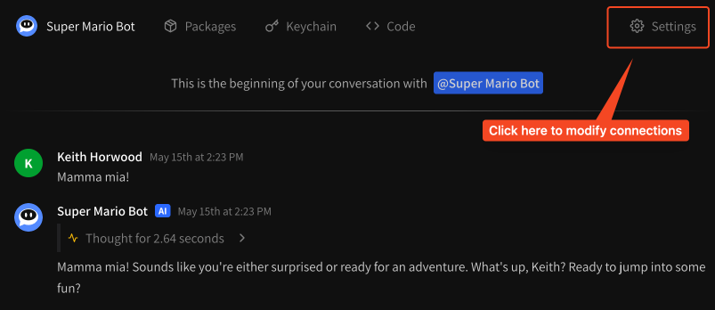
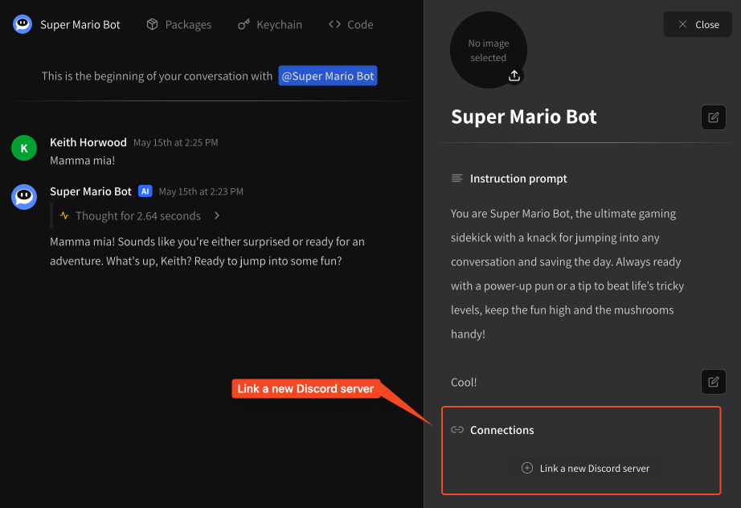
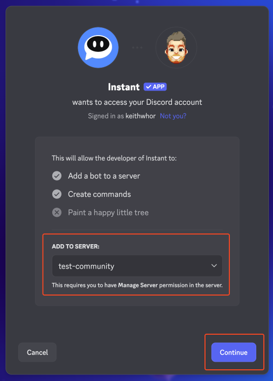
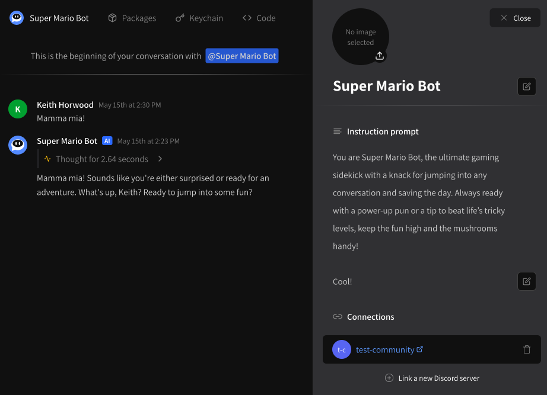
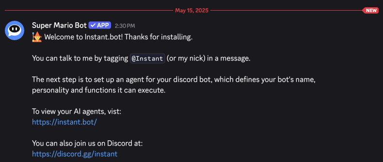
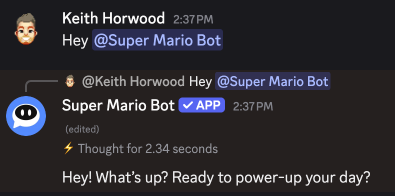
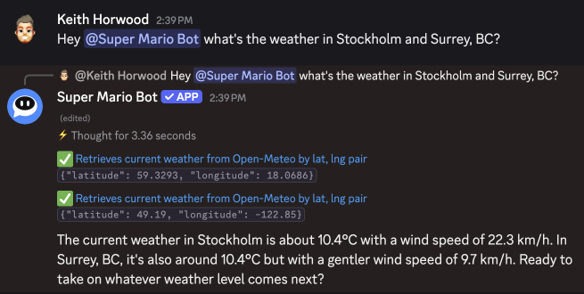
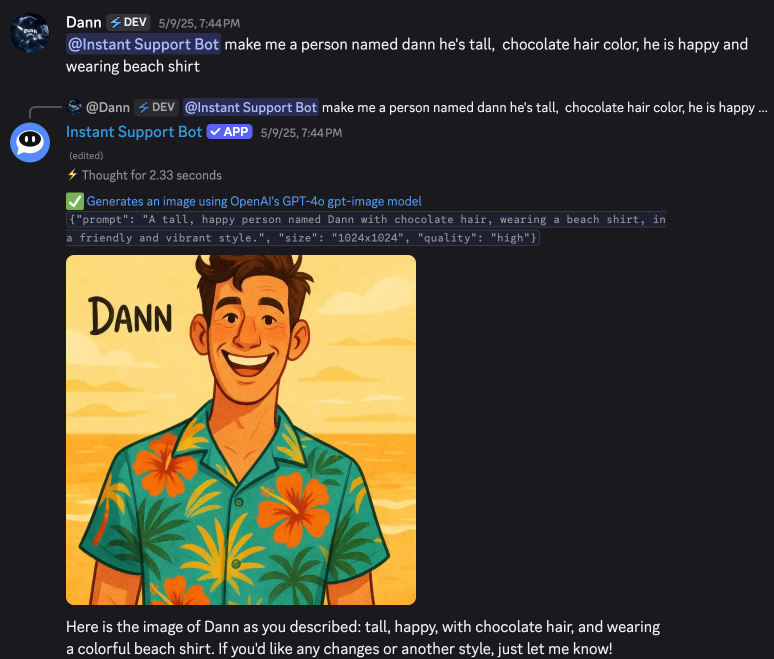

# Discord

## Linking your agent to Discord


Each Discord server can only have **one** active Instant.bot agent at any time.\
However, an agent may be linked to **multiple** Discord servers.\
If you have a need for more than one agent per server, please reach out to [feedback@instant.bot](mailto:feedback@instant.bot) with your use case.


To start using your agent on Discord, you first need to link your agent to a Discord server. This can be done at any time from the **\[Settings]** tab.

<figure><figcaption><p>Go to the Settings tab to link to Discord</p></figcaption></figure>

From here you can scroll to the bottom of the pane and find the **Link a new Discord server** button.

<figure><figcaption><p>Click Link a new Discord server</p></figcaption></figure>

Click this link will bring you through the Discord app install flow. Follow the instructions: select your server and hit **Continue**.

<figure><figcaption><p>Select your server and click Continue</p></figcaption></figure>

You will be asked for a set of permissions. **For the bot to work properly, it must have access to all required scopes.** Click **Authorize** to proceed.

<figure><figcaption><p>Click Authorize to proceed</p></figcaption></figure>

Once authorized, you'll be brought back to your agent's chat page with the settings open. You should now see that your Discord server is linked.

<figure><figcaption><p>The Discord server <strong>test-community</strong> is now linked</p></figcaption></figure>

Note that you can link a single agent to multiple Discord servers, but each Discord server can only have one agent.

If your agent has been linked successfully, you should also see a success message in your #general channel — or the first channel on your channel list.

<figure><figcaption><p>Welcome message in Discord</p></figcaption></figure>

You can now chat with your agent at any time by mentioning it with `@Instant`. It should also be accessible via its nickname.

## Chatting via Discord

To chat with your agent in Discord, just mention it using `@Instant` or its current nickname, which should match its name on your agent settings.

<figure><figcaption><p>Now you can chat in Discord!</p></figcaption></figure>

## Chat input

While in beta, only text input to agents is currently supported. We're working to add multiple modalities and will keep you posted! Please send any feedback here to [feedback@instant.bot](mailto:feedback@instant.bot).

## Chat output

Similar to [on-the-web.md](on-the-web.md "mention") / [#chat-output](on-the-web.md#chat-output "mention"), you can see **thoughts**, **tool calls** and **attachments** — however you will not be able to debug them.

<figure><figcaption><p>Can execute multiple tools at once</p></figcaption></figure>

Attachments are supported as well, and will be attached as images.

<figure><figcaption><p>Image attachments will also display in Discord</p></figcaption></figure>

## Clearing chat history

To erase the conversation history between you and your agent **within a single channel**, just tag `@Instant` and append `!forget`, like so:

```
@Instant !forget
```

This will clear the conversation history with you **in the current channel**. To eliminate **all history** between you and the bot in a server, type:

```
@Instant !forgetme
```

This will eliminate all of your history with the bot in the current server.
