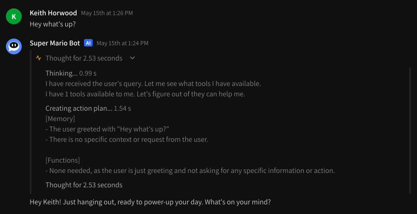
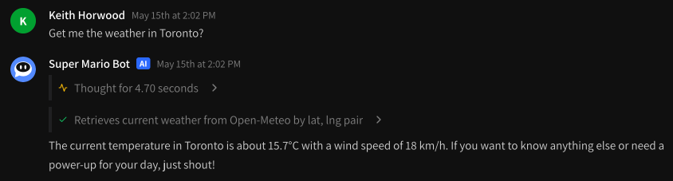
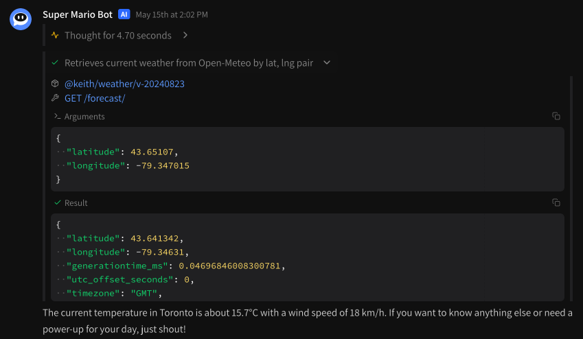
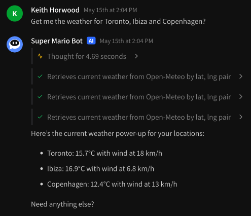
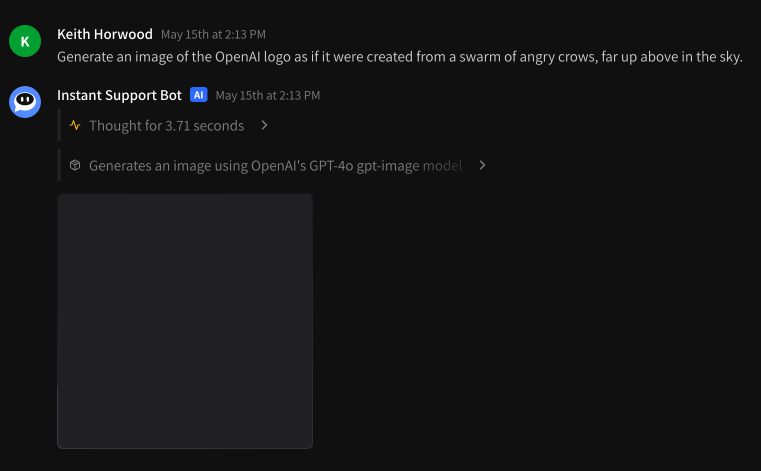
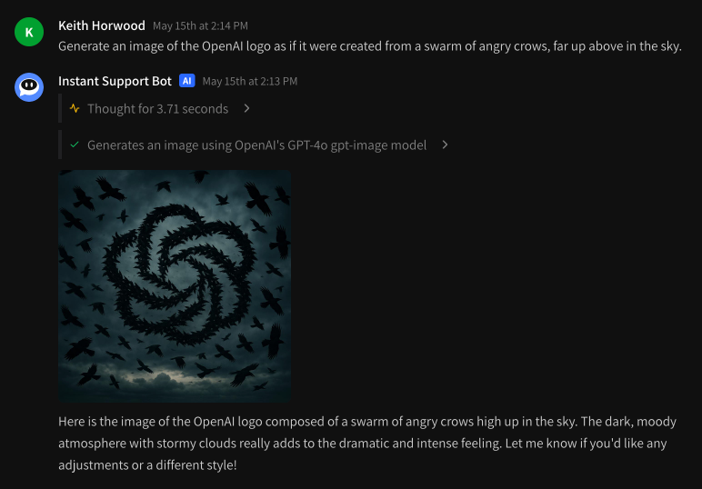

# On the web

## Chatting via Instant.bot

You can chat with your agents at any time via [instant.bot/chat](https://instant.bot/chat).

<figure><figcaption><p>Chatting is easy</p></figcaption></figure>

When in desktop mode, simply write your agent a message and hit enter! To add multiple newlines from the desktop, use `[shift]+[enter]`. In mobile mode you need to press the send arrow to send a message — you can write multiple lines without sending the message automatically.

## Chat input

While in beta, only text input to agents is currently supported. We're working to add multiple modalities and will keep you posted! Please send any feedback here to [feedback@instant.bot](mailto:feedback@instant.bot).

## Chat output

### Thoughts

Your agent will spend a little bit of time thinking before sending each response. This step is a planning step based on memory and tool context. The thinking step helps make sure the agent is responding appropriately and making any tool calls it feels is necessary. You can expand upon the agent's thoughts at any time by clicking the `Thought for ...` button.

<figure><figcaption><p>See the agent's planning process</p></figcaption></figure>

Typically you'll see a **\[Memory]** and **\[Functions]** setting which shows you how your agent is processing things you've said previously and any tools it may want to call. You can use these thoughts to help debug: if your agent is a little over-eager to execute certain tools, try [modifying your instruction prompt](../modifying-instruction-prompt.md) to compensate.

### Tool calls


While in beta we are still working on multi-step tool calling. It is not supported in the current build, though parallel tool calling works like a charm.


If your agent needs to call any tools, you'll see a separate **\[ Tool call > ]** button for each tool it's calling. There will be a success or failure indicator to the left (success is a checkmark).

<figure><figcaption><p>Tool calling built into Instant.bot</p></figcaption></figure>

At any point during the tool call you can inspect it by clicking on it: while processing it will show arguments, and when complete you'll see the full JSON response.

<figure><figcaption><p>Expand the tool call information by clicking</p></figcaption></figure>

You can also execute multiple tool calls in parallel.

<figure><figcaption><p>Multiple tools can be executed at once</p></figcaption></figure>

### Attachments

If the expected result of a tool call is of type `buffer` (see [package-specification.md](../specifications/package-specification.md "mention") for more details) while the tool is executing attachments (square boxes) will automatically appear on the screen. An example is the [OpenAI GPT Image Generator](https://instant.bot/packages/@keith/openai-gpt-image).

<figure><figcaption><p>Generate an image and an attachment</p></figcaption></figure>

If the result of the tool call has a `Content-Type: image/*` header then the image will automatically be loaded in the chat as an attachment once complete.&#x20;

<figure><figcaption><p>Images are display inline</p></figcaption></figure>

## Clearing chat history

To erase your current chat history, just type `!forget` at any time, like so:

```
!forget
```

And your conversation history will be cleared.
